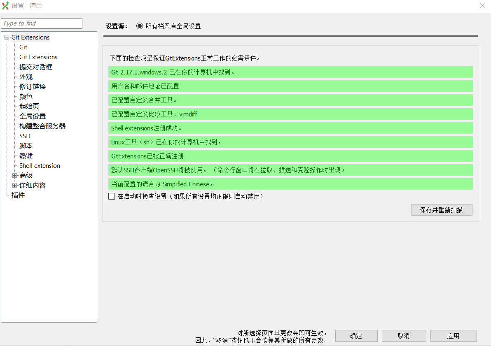

# 文档协作指南

&emsp;&emsp;我们的 FAQ 文档基于 GitHub 部署。文档协作可由以下两种方式进行：

1. 由管理员将您设置为内部协作者（collaborator），然后直接在当前 GitHub 工作分支中进行操作。
1. Fork 本代码仓库后，在自己的代码库中做出修改，并提出 pull request（拉取请求）

## 内部协作者

&emsp;&emsp;作为内部协作者，您需要注意：

1. `master` 分支为保护分支，通常情况下不应该直接操作
1. 修改需要在工作分支 `working` 中进行，待编辑完成后再合并进入 `master` 分支
1. 合并建议通过 pull request 的方式进行，此时需要由其他协作者做出审查（review），待修改通过（approved）后方可合并进入 `master` 分支

## 其他参与者

&emsp;&emsp;作为参与者，参与文档协作的具体步骤为：

1. Fork 本代码库，并将您的代码仓库克隆（clone）到本地
1. 对文档做出修改
1. 提出 pull request 至本代码仓库的 `working` 分支

&emsp;&emsp;您还需要注意：

1. 请遵守本项目的 [格式指南](STYLE_GUIDE.md)
1. 请保持提交历史的整洁
1. 请避免加入您的个人敏感信息，如 GitHub 账号、密码等

## 下载 Git

&emsp;&emsp;第一次接触 Git 的用户可以从 [Git官网](https://git-scm.com/) 下载。

&emsp;&emsp;对于新手，我们建议同时安装 [gitextensions](https://gitextensions.github.io/)，安装完成后设置好就可以用了，如下图：

&emsp;&emsp;配置好后按确定即可。
